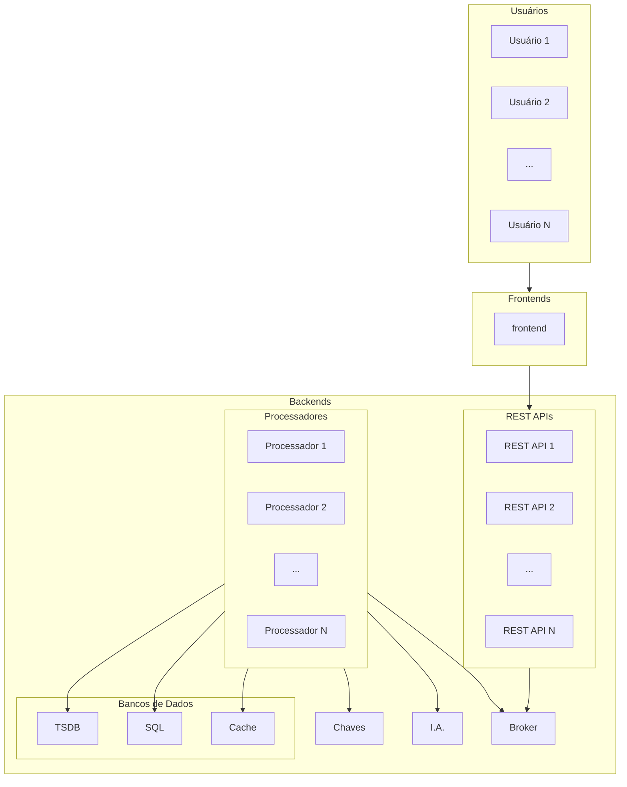
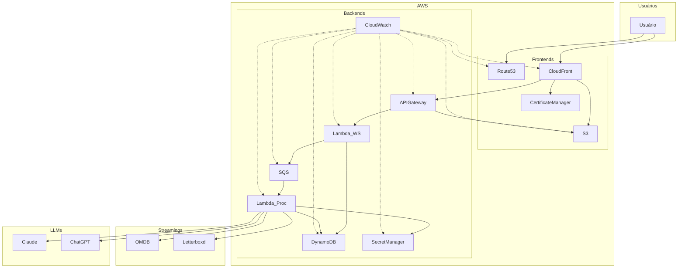

# ISN 2026.1

Projeto da disciplina ISN 75620501, edição 2026.1.

## Preparação da nuvem AWS

Para rodar a aplicação, você precisará criar tokens na AWS e no Pulumi:

No serviço [IAM](https://console.aws.amazon.com/iam/):

1. Criar um [grupo de usuário](https://console.aws.amazon.com/iam#/groups).
1. Criar um [usuário](https://console.aws.amazon.com/iam#/users) e associá-lo ao grupo criado. Importante: esse usuário não deve ter acesso ao AWS Management Console.
1. Criar uma política de acordo com [docs/iam-policy.json](docs/iam-policy.json) e associá-la ao grupo criado.
1. De volta ao usuário criado, deve-se criar uma chave de acesso, a qual é composta por um identificador (`AWS_ACCESS_KEY_ID`) e a chave propriamente dita (`AWS_SECRET_ACCESS_KEY`).

## Preparação do GitHub Codespaces

Para facilitar o uso da nuvem pública, AWS, foi criado um repositório (monorepo) para uso compartilhado. Entretanto, cada usuário deve configurar suas variáveis de ambiente, o que inclui chaves de acesso. Para que seus Tokens sejam utilizados no codespaces, você precisa adicioná-los nas suas configurações de usuário:


Para AWS:

- `AWS_ACCESS_KEY_ID`: identificador da chave de acesso ao AWS.
- `AWS_SECRET_ACCESS_KEY`: chave de acesso ao AWS, propriamente.
- `AWS_DEFAULT_REGION`: região da AWS. Por convenção, na equipe será adotado por padrão São Paulo (`sa-east-1`).

Fonte: [Configuring environment variables for the AWS CLI
](https://docs.aws.amazon.com/cli/v1/userguide/cli-configure-envvars.html).

Para Pulumi:

- `PULUMI_ACCESS_TOKEN`: chave de acesso ao Pulumi.

Fonte: [pulumi login | CLI commands](https://www.pulumi.com/docs/iac/cli/commands/pulumi_login/).

## Rodando a aplicação

### Ambiente de desenvolvimento local

```bash
make install       # instala AWS CLI, SAM CLI, Pulumi e uv
uv sync            # instala dependências Python
```

### Deploy para AWS

```bash
uv run pulumi preview --stack dev   # simula alterações
uv run pulumi up --stack dev        # implanta infraestrutura
```

#### Bypass de autenticação (somente dev/local)

Por padrão, os Lambdas **não** aceitam `sub` diretamente na requisição (sem JWT validado).
Para facilitar testes em ambiente de desenvolvimento, é possível habilitar um bypass de auth
de forma **explícita** via Pulumi config:

```bash
pulumi config set isn20261:disableAuth true --stack dev
```

No stack `dev` do repositório, esse valor já está definido em `Pulumi.dev.yaml`.
Em `prod`, essa opção é bloqueada.

### Testes

```bash
# Executa todos os testes da pasta tests/ com saída detalhada
uv run pytest tests/ -v

# Executa os testes + mede cobertura da pasta functions/
# Mostra linhas não cobertas e falha se cobertura < 85%
uv run pytest -v --cov=functions --cov-report=term-missing --cov-fail-under=85

# Executa a Lambda localmente via AWS SAM e chama Lambda genérico 'handler.py'
# iniciando e encerrando automaticamente a infraestrutura necessária
make sam
```

Os testes usam `moto` para simular DynamoDB e Cognito, sem precisar de Docker ou credenciais AWS. O plano de testes está documentado em [`docs/test-plan-layer1.md`](docs/test-plan-layer1.md).

## Requisitos

São requisitos funcionais:

1. O sistema deve ter suporte a dispositivos móveis (Android e iOS) e computadores pessoais como *notebooks* e *tablets* (Windows, Linux e MacOS/iPadOS).
2. Permitir o cadastro de usuário por email e senha.
3. Prover autenticação via email e senha.
4. Permitir a troca de senha.
5. Permitir recuperação de senha por email.
6. Realizar log de todas as operações realizadas pelo usuário.
7. Permitir que o usuário peça um filme para assistir, o qual será entregue de forma aleatória de um banco de dados online.
8. Permitir que o usuário personalize a sua experiência com base do seu histórico de uso.
9. Permitir que o usuário escolha o **humor do dia** para filtrar os possíveis filmes.
10. Permitir que os filmes sejam filtrados por faixa etária.
11. Permitir que uma sugestão possa entrar na fila para assistir depois.
12. Executar rotinas de qualidade antes de publicar a solução.
13. Automatizar integração e implantação de código (CI/CD).

São requisitos desejáveis, não obrigatórios:

1. Apresentar uma árvore de decisão com poucas perguntas (cerca de 3) para filtrar as opções de filmes.
2. Permitir integração com agenda para assistir depois.
3. Usar aprendizado de máquina para melhorar as sugestões de filme.
4. Usar recomendações de redes sociais, com base em quantidade de menções, para melhorar a oferta de filmes.
5. Integrar com Letterbox.

São requisitos não funcionais:

1. O sistema deve ter boa responsividade.
2. O sistema deve rodar sob baixa latência.
3. O sistema deve rodar sob custo mínimo, se for o caso multinuvem com *service mesh*.

## Diagrama de blocos

Com serviços de nome genérico:



Com serviços AWS:


